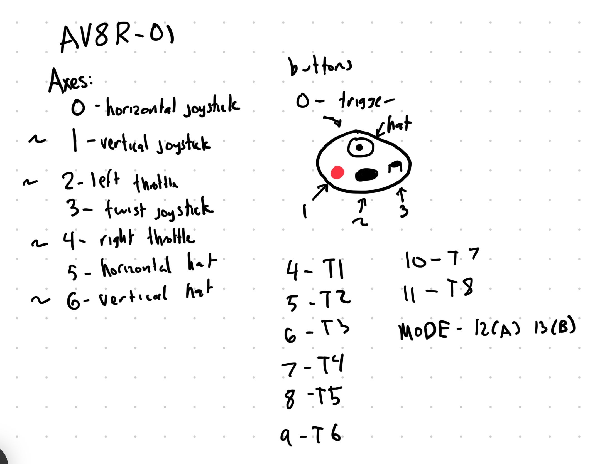

# Motorized Couch

## Installation

1. Install Conda packages from environment.yml
```bash
conda env create -f environment.yml
```
2. Install PyVESC by typing:
```bash
pip install git+https://github.com/LiamBindle/PyVESC.git
```
3. Change the value `_comm_forward_can` in line 17 of base.py of the VESC library from 33 to 34.

4. To use, run `python joystick_driving`

Consider running `sudo pmset -a disablesleep 1` in laptop mode.

As seen on tiktok

https://www.tiktok.com/@horsebeforecouch/video/7219792981576977706


